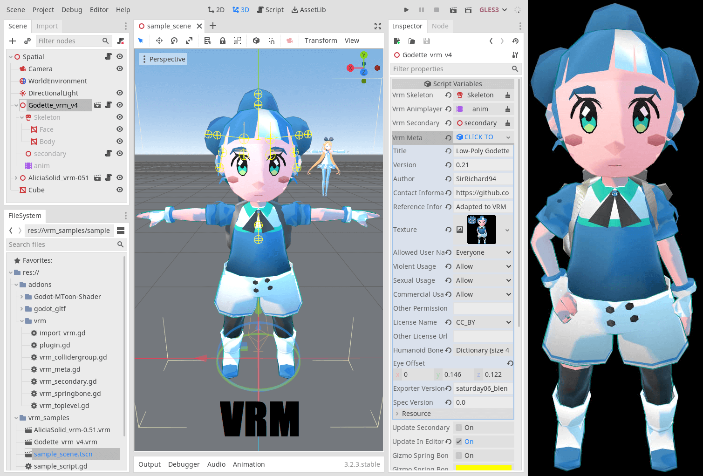

# AI Girls

> **LLM-controlled VRoid avatars with real-time animations powered by Godot Engine**

An AI companion system that brings virtual avatars to life through natural language conversations. The system uses VRoid Studio characters with Mixamo animations, controlled by Large Language Models for expressive, synchronized visual feedback.

Available in **two deployment modes**:
- 🖥️ **Desktop Mode**: MCP server for Claude Desktop and compatible LLM clients
- 🌐 **Web Mode**: Full-stack web app with React + Hono backend (deployable to VPS)



## 🎯 What is AI Girls?

AI Girls is a framework for creating **interactive AI companions** with visual presence. Unlike text-only chatbots, these companions express themselves through:

- **Animated body language**: Wave, jump, dance, sit, and more via Mixamo animations
- **Facial expressions**: Happy, sad, surprised, angry - synchronized with conversation tone
- **Gaze direction**: Look at the user, look away, look down - adding natural interaction cues
- **Real-time response**: Visual feedback happens instantly as the LLM processes conversation

### The Vision

Create AI companions that feel alive through the combination of:
1. Natural language understanding and conversation (LLM)
2. Expressive 3D avatars (VRoid + Godot)
3. Contextual animations and emotions (via tool calling)

## 🏗️ Architecture

### Web Mode (Recommended)

```
┌─────────────────────────────────────────┐
│  Browser                                │
│  ┌─────────────────────────────────┐   │
│  │  React Frontend                 │   │
│  │  (shadcn/ui + Tailwind)        │   │
│  └──────────┬──────────────────────┘   │
│             │ HTTP/WebSocket            │
│  ┌─────────────────────────────────┐   │
│  │  Godot HTML5 Canvas             │   │
│  │  (VRM Avatar)                   │   │
│  └──────────┬──────────────────────┘   │
└─────────────┼──────────────────────────┘
              │
┌─────────────▼──────────────────────────┐
│  Hono Backend Server                   │
│  ┌─────────────────────────────────┐   │
│  │  Gemini AI (via AI SDK)         │   │
│  │  + Avatar control tools         │   │
│  └─────────────────────────────────┘   │
│  ┌─────────────────────────────────┐   │
│  │  WebSocket Servers              │   │
│  │  (Godot + Frontend)             │   │
│  └─────────────────────────────────┘   │
└─────────────────────────────────────────┘
```

### Desktop Mode

```
┌─────────┐     ┌──────────┐     ┌─────────────┐     ┌──────────┐     ┌─────────────┐
│  User   │ ←→  │   LLM    │ ←→  │ MCP Server  │ ←→  │ WebSocket│ ←→  │   Godot     │
│         │     │ (Claude) │     │ (Node.js)   │     │          │     │ (Desktop)   │
└─────────┘     └──────────┘     └─────────────┘     └──────────┘     └─────────────┘
    Text          Decides              Tools            JSON           Animations
  conversation    expressions          API             commands        + Expressions
```

## 🚀 Quick Start

### Web Mode (Recommended)

**Prerequisites:**
- Node.js 20+
- Godot 4.5 (for exporting HTML5 build)
- Gemini API key ([Get one here](https://makersuite.google.com/app/apikey))

**1. Quick Start Script:**
```bash
git clone https://github.com/yourusername/ai-girls.git
cd ai-girls

# Add your Gemini API key
cd backend
cp .env.example .env
# Edit .env and add GEMINI_API_KEY

# Start all services
cd ..
./dev-start.sh
```

This starts:
- Backend on `http://localhost:3000`
- Frontend on `http://localhost:5173`

**2. Export Godot to HTML5:**
```bash
# Open godot/ folder in Godot Editor
godot --editor --path godot/

# Then: Project → Export → Web (HTML5)
# Export to ../godot-web-build/index.html
```

**3. Access:**
Open `http://localhost:5173` in your browser and start chatting!

### Desktop Mode

**Prerequisites:**
- Godot Engine 4.5+
- Node.js 18+
- Claude Desktop (or compatible MCP client)

**1. Install Dependencies:**
```bash
git clone https://github.com/yourusername/ai-girls.git
cd ai-girls

cd live-vroid-mcp
npm install
npm run build
cd ..
```

**2. Start Godot:**
```bash
# Open Godot project (godot/ folder)
godot --editor --path godot/

# Or run directly (WebSocket server on port 8080)
godot --path godot/ godot/scenes/model.tscn
```

**3. Start MCP Server:**
```bash
cd live-vroid-mcp
npm run dev
```

**4. Configure Claude Desktop:**

Add to config (`~/Library/Application Support/Claude/claude_desktop_config.json`):
```json
{
  "mcpServers": {
    "live-vroid": {
      "command": "node",
      "args": ["/absolute/path/to/ai-girls/live-vroid-mcp/build/index.js"]
    }
  }
}
```

**5. Start Chatting:**
Open Claude Desktop and start a conversation. The AI will automatically control the avatar!

## 📁 Project Structure

```
ai-girls/
├── frontend/                   # React web frontend (Web Mode)
│   ├── src/
│   │   ├── components/        # UI components (shadcn/ui)
│   │   ├── hooks/            # React hooks
│   │   └── lib/              # API client
│   └── package.json
│
├── backend/                    # Hono backend (Web Mode)
│   ├── src/
│   │   ├── ai/               # Gemini AI (AI SDK)
│   │   ├── websocket/        # WebSocket servers
│   │   ├── routes/           # HTTP routes
│   │   └── lib/              # Avatar control
│   └── package.json
│
├── godot/                      # Godot 4.5 project
│   ├── scripts/
│   │   └── VRoidWebSocketController.gd  # Dual-mode controller
│   ├── scenes/               # Godot scenes
│   ├── addons/               # VRM & MToon addons
│   ├── animations/           # Animation libraries
│   ├── vrm_samples/          # Example VRM models
│   └── project.godot
│
├── live-vroid-mcp/            # MCP server (Desktop Mode)
│   ├── src/
│   │   ├── index.ts          # MCP tools
│   │   └── godot_connection.ts
│   └── package.json
│
├── godot-web-build/           # Godot HTML5 export
│
└── deployment/                # VPS deployment configs
    ├── nginx/                # Nginx reverse proxy
    └── systemd/              # Systemd service
```

## 🎮 Avatar Control

### Available Animations

**Body Animations:**
`idle`, `wave`, `sit`, `jump`, `dance`, `blow_kiss`, `clap`, `bow`, `nod`, `shake_head`

**Emotions:**
`neutral`, `happy`, `sad`, `angry`, `surprised`, `relaxed`

**Look Directions:**
`user`, `away`, `down`, `up`, `left`, `right`

### MCP Tools (Desktop Mode)

**`control_avatar`** - Direct control
```typescript
control_avatar({
  clip: "wave",        // Animation
  emotion: "happy",    // Expression
  lookAt: "user"       // Gaze
})
```

**`animate_from_text`** - Natural language
```typescript
animate_from_text({
  text: "wave happily at the user"
})
```

**`sequence_animations`** - Multiple animations
```typescript
sequence_animations({
  sequence: [
    { clip: "wave", emotion: "happy", delay: 0 },
    { clip: "jump", emotion: "excited", delay: 2000 }
  ]
})
```

### AI SDK Integration (Web Mode)

The backend uses Vercel AI SDK with Gemini provider:
- Unified tool calling interface
- Easy to switch LLM providers
- Built-in streaming support
- Type-safe with Zod schemas

## 🛠️ Development

### Adding New Animations

1. Get animation from Mixamo (FBX format)
2. Import to Godot project (`godot/mixamo_models/`)
3. Add to AnimationPlayer
4. Update `animation_mappings` in `godot/scripts/VRoidWebSocketController.gd`
5. For web: Re-export HTML5 build

### Modifying AI Behavior

**Web Mode:** Edit system prompt in `backend/src/ai/gemini.ts`

**Desktop Mode:** Control via LLM client conversation

### Testing WebSocket Directly

```bash
# Install websocat
brew install websocat

# Connect to Godot (Desktop Mode)
websocat ws://localhost:8080

# Send command
{"clip": "wave", "emotion": "happy", "lookAt": "user"}
```

## 🌐 Deployment

### Web Mode Deployment (VPS)

Full guide in [`deployment/README.md`](deployment/README.md)

**Quick Overview:**
```bash
# On your VPS (Ubuntu)
git clone https://github.com/yourusername/ai-girls.git
cd ai-girls

# Build backend
cd backend && npm install && npm run build

# Build frontend
cd ../frontend && npm install && npm run build

# Setup systemd service
sudo cp deployment/systemd/ai-girls.service /etc/systemd/system/
sudo systemctl enable ai-girls
sudo systemctl start ai-girls

# Setup Nginx
sudo cp deployment/nginx/ai-girls.conf /etc/nginx/sites-available/
sudo ln -s /etc/nginx/sites-available/ai-girls.conf /etc/nginx/sites-enabled/
sudo systemctl reload nginx

# Get SSL certificate
sudo certbot --nginx -d your-domain.com
```

**Costs (Estimated):**
- Hetzner VPS: €5-10/month
- Domain: €10/year
- Gemini API: Free tier or pay-as-you-go
- **Total:** ~€15-20/month

### Desktop Mode

No deployment needed - runs locally.

## 🎨 Asset Pipeline

```
VRoid Studio → Mixamo (auto-rig) → Blender (merge) → glTF → Godot → HTML5
   Character      Animations         Cleanup        Export   Import   Web Export
```

## 📚 Documentation

- **[CLAUDE.md](CLAUDE.md)** - Complete technical documentation
- **[WEB_DEPLOYMENT_README.md](WEB_DEPLOYMENT_README.md)** - Web deployment guide
- **[backend/README.md](backend/README.md)** - Backend details
- **[frontend/README.md](frontend/README.md)** - Frontend details
- **[deployment/README.md](deployment/README.md)** - VPS deployment

## 🔮 Future Plans

- [x] **Web Mode**: Full-stack web deployment ✅
- [x] **AI SDK Integration**: Unified LLM interface ✅
- [ ] **Voice Integration**: Speech-to-text input
- [ ] **TTS + Lip Sync**: Synchronized speech with mouth shapes
- [ ] **Persistence**: Database for conversation history
- [ ] **Multi-Avatar**: Switch between characters
- [ ] **Streaming Responses**: Real-time text streaming
- [ ] **Mobile Support**: Responsive design for phones/tablets

## 🤝 Credits & Acknowledgments

### Core Technologies
- **[Godot Engine](https://godotengine.org/)** - Open-source 3D engine
- **[VRM Specification](https://vrm.dev/)** - VR avatar standard
- **[V-Sekai VRM Addon](https://github.com/V-Sekai/godot-vrm)** - VRM for Godot
- **[VRoid Studio](https://vroid.com/)** - Character creation
- **[Mixamo](https://www.mixamo.com/)** - Animation library
- **[Vercel AI SDK](https://sdk.vercel.ai/)** - Unified LLM interface
- **[Model Context Protocol](https://github.com/modelcontextprotocol)** - LLM integration
- **[Hono](https://hono.dev/)** - Web framework
- **[shadcn/ui](https://ui.shadcn.com/)** - React components

### VRM Addon Contributors (V-Sekai Team)
- [@aaronfranke](https://github.com/aaronfranke) and [The Mirror team](https://www.themirror.space/)
- [@fire](https://github.com/fire)
- [@TokageItLab](https://github.com/TokageItLab)
- [@lyuma](https://github.com/lyuma)
- [@SaracenOne](https://github.com/SaracenOne)

### VRM Tooling
- [VRM Consortium](https://github.com/vrm-c)
- [@Santarh](https://github.com/Santarh)
- [@ousttrue](https://github.com/ousttrue)
- [@saturday06](https://github.com/saturday06)
- [@FMS-Cat](https://github.com/FMS-Cat)

## 📝 License

This project is licensed under the MIT License - see the [LICENSE](LICENSE) file for details.

## 🐛 Issues & Support

For issues and feature requests, please use the [GitHub issue tracker](https://github.com/yourusername/ai-girls/issues).

For technical documentation and development guide, see [CLAUDE.md](CLAUDE.md).

---

**Made with ❤️ for the future of interactive AI companions**
